# Hey 👋, I'm Specode

Building tools for AI-assisted development — with a focus on **Pi extensions**, **agent workflows**, and **developer experience**.

- **AI tooling** — subscription usage, image generation, and browser integration
- **Agent workflows** — shared rules and harness-specific configuration
- **Developer setup** — dotfiles and Neovim configuration

### GitHub at a glance

Updated daily from public GitHub data. Language usage measures code bytes, not proficiency.

### Selected projects

| Project | What it does |
| :--- | :--- |
| [**pi-subscription-image**](https://github.com/specode/pi-subscription-image) | Generate and edit images in Pi using existing Codex and Grok subscriptions. |
| [**pi-subscription-usage**](https://github.com/specode/pi-subscription-usage) | Check subscription quota for Codex, OpenCode Go, Grok, and Kimi. |
| [**pi-kimi-webbridge-bootstrap**](https://github.com/specode/pi-kimi-webbridge-bootstrap) | Install and update the official Kimi WebBridge runtime and skill for Pi. |
| [**pi-kimi-cu**](https://github.com/specode/pi-kimi-cu) | Set up Kimi Computer Use and MCP for Pi. |
| [**agent-config**](https://github.com/specode/agent-config) | Shared agent rules and harness-specific user configuration. |

### My setup

[Neovim config](https://github.com/specode/nvim-config) · [Dotfiles](https://github.com/specode/dotfiles) · [More repositories →](https://github.com/specode?tab=repositories)
